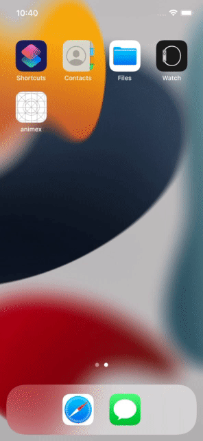

# AnimeX



A cross-platform anime catalog application that allows users to browse and search anime and mark them as favorite.

## Get started

Make sure you have followed the instructions provided in the official [documentation](https://reactnative.dev/docs/environment-setup) and you have your environment set up.

### Install dependencies

```sh
yarn
```

### Run the application

```sh
yarn android
yarn ios
yarn web # not working yet
```
